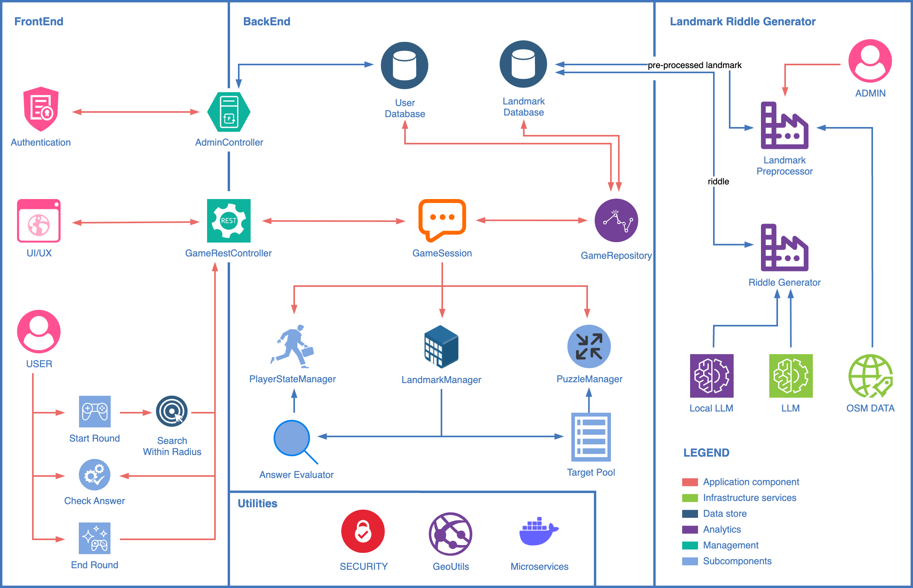

# 👋 GRexrr at your Service

I'm currently completing my MSc in Computer Science at University College Cork (UCC), Ireland.  
My thesis work explores how **AI, geospatial data, and modular architecture** can be combined to create intelligent, exploratory systems.

I use **Mandarin** and **English**. I also speak **Cantonese** — and I code in all three when needed 😉.

---

## Personal Demo – Urban Puzzle System  
> *Thesis-based personal demo. Subject to continuous development. Not open for contribution.*

This project explores how **LLMs, urban landmark metadata**, and **player movement** can be integrated into a spatially-aware, riddle-based exploration system.

- Java Spring Boot backend for session, puzzle, and player logic  
- Python-based microservice for real-time LLM riddle generation (GPT / llama.cpp local deployment)
- Leaflet.js frontend for map interaction, player orientation, and target logic **(MVP Stage)**  
- Wikipedia/OSM-based landmark "metadata" preprocessing pipeline  
- MongoDB for persistent storage of riddles, sessions, and landmark data  
- Epistemic planning agent module **under construction** (to adapt riddles based on player knowledge state)  
- ☁️ *Future:* containerization via Docker/Kubernetes and cloud hosting (AWS)

🔗 [Source code (private)](https://github.com/grexrr/scavengerHunt)  
🔗 [Riddle Agent (private)](https://github.com/grexrr/scavenger.RiddleAgent)  
🔗 [Landmark Processor (private)](https://github.com/grexrr/scavenger.LandmarkProcessor)

🧾 [Thesis Abstract](#) *(Available on request)*

---

## 🛠️ Technologies

**Languages & Platforms**  
`Java 17` · `Python 3.10` · `JavaScript` · `HTML/CSS` · `Bash`

**Frameworks**  
`Spring Boot 3.x` · `Flask` · `Leaflet.js` · `LLM API (OpenAI / llama.cpp)`

**Data & Infrastructure**  
`MongoDB` · `RESTful API` · `Docker` · `Kubernetes & Jenkins Pipeline` *(planned)*

**Tech Focus Areas**  
`LLM Integration` · `Geospatial Interaction` · `Prompt Engineering` · `Microservice Design` · `Urban Data Processing` · `Agent Behavior Modeling`

---

## 🪪 Looking Forward

**I'm not launching a product — this is a space of exploration.**  
It's part of my experiment to build a **second digital habitat**, a side-track identity powered by code, narrative, and cognition.

I'm especially interested in:
- Agentic systems & epistemic logic
- Narrative-based urban experience
- Web3-based open collaboration frameworks

📬 Always open to connect with:
- Builders working on creative infrastructure
- Web3 explorers & DAO practitioners
- Game/interaction designers with a spatial focus

---
